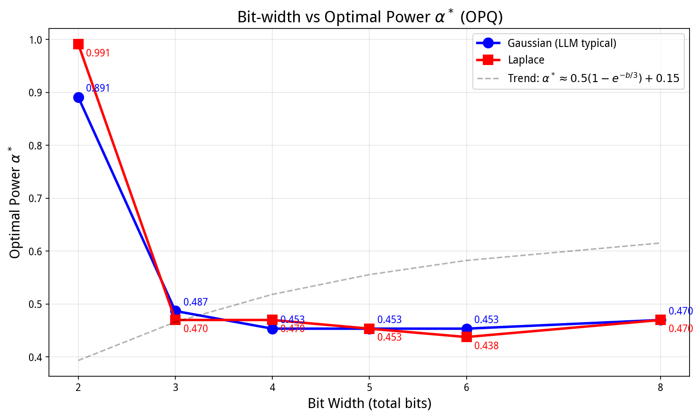

# Chapter 1: Optimal Power Quantization (OPQ)

## A Generalized Nonlinear Quantization Framework for Large Language Models

> —— 从平方根到最优幂次：以算代存的完整理论

---

## 目录

- [1. 引言](#1-引言)
- [2. 方法论：带符号幂次量化](#2-方法论带符号幂次量化)
- [3. 基础验证：8-bit 场景](#3-基础验证8-bit-场景)
- [4. 4-bit 场景：高阶根的探索](#4-4-bit-场景高阶根的探索)
- [5. 核心贡献：Bit-width vs Optimal α\*](#5-核心贡献bit-width-vs-optimal-α)
- [6. 总结与展望](#6-总结与展望)
- [附录：核心代码](#附录核心代码)

---

## 1. 引言

大型语言模型的部署受限于高昂的存储开销。模型量化通过将浮点权重映射至低比特整数域，是主流的压缩手段。然而，低比特场景下线性量化的均匀台阶与小权重的高敏感度不匹配，导致精度断崖式下跌。

本文提出 **Optimal Power Quantization (OPQ)**——一种基于可调幂次变换的非线性量化框架。核心思想源于一个朴素直觉：$10000 = 100^2$ 可以用一次平方运算代替存储大数。OPQ 将这一思想推广到任意幂次 $p$，并系统性地找到了每个比特宽度下的最优值。

---

## 2. 方法论：带符号幂次量化

### 2.1 数学定义

**量化（Encoding）：**

$$W_q = \text{sign}(W) \cdot \text{Round}\left( \frac{|W|^\alpha}{\epsilon^\alpha} \cdot s \right)$$

**反量化（Decoding）：**

$$\hat{W} = \text{sign}(W_q) \cdot \left( \frac{\text{Abs}(W_q)}{s} \right)^{1/\alpha} \cdot \epsilon$$

其中：

- $\alpha \in (0, 1)$ 为幂次参数（本文核心研究对象）
- $\epsilon = 1.00001$ 为防零常数
- $s = (2^{b-1}-1) / (1/\epsilon)^\alpha$ 为缩放因子
- $b$ 为总比特数，符号占 1-bit，幅值占 $b-1$ bits

### 2.2 与"以算代存"的哲学联系

OPQ 是 $10000 = 100^2$ 这一朴素直觉的深度学习版本：

- **存**：$W_q$（低比特整数）+ $s$（标量）+ $\alpha$（常数）
- **算**：推理时执行一次幂次运算 $(q/s)^{1/\alpha}$ 还原权重
- **省**：用 $b$ 比特存储代替原始 FP16 的 16 比特，压缩比 $16/b$

---

## 3. 基础验证：8-bit 场景

### 3.1 误差对照表

**表 1：8-bit 线性量化 vs 8-bit OPQ（α=0.5）误差对照**

| $x$ | Linear $q$ | Linear $\hat{x}$ | Linear Rel Err | OPQ $q$ | OPQ $\hat{x}$ | OPQ Rel Err |
|:----:|:----------:|:----------------:|:--------------:|:-------:|:-------------:|:------------:|
| 0       | 0   | 0.0000 | —       | 0   | 0.000000 | —       |
| 0.0001  | 0   | 0.0000 | 100.0%  | 1   | 0.000062 | 38.0%   |
| 0.001   | 0   | 0.0000 | 100.0%  | 4   | 0.000992 | 0.8%    |
| 0.01    | 3   | 0.0118 | 17.6%   | 13  | 0.010478 | 4.8%    |
| 0.1     | 26  | 0.1020 | 2.0%    | 40  | 0.099200 | 0.8%    |
| 0.5     | 128 | 0.5020 | 0.4%    | 90  | 0.502201 | 0.4%    |
| 1.0     | 255 | 1.0000 | 0.0%    | 127 | 1.000000 | 0.0%    |

> 8-bit OPQ 将小值区平均相对误差从 53.6% 降至 14.5%，**改进 3.7 倍**。

---

## 4. 4-bit 场景：高阶根的探索

### 4.1 三种变换对比

**表 2：4-bit 不同幂次变换误差对照**

| $x$ | Sqrt $q$ (α=0.5) | Sqrt Rel Err | 4th Root $q$ (α=0.25) | 4th Root Rel Err |
|:----:|:----------------:|:------------:|:---------------------:|:----------------:|
| 0.0004 | 0 | 100.0% | 1 | 4.1%  |
| 0.01   | 1 | 104.1% | 2 | 33.4% |
| 0.04   | 1 | 49.0%  | 3 | 15.7% |
| 0.1    | 2 | 18.4%  | 4 | 6.6%  |
| 0.5    | 5 | 2.0%   | 6 | 8.0%  |

> 4th Root 在小值区更优但大值区退化，引出核心问题：**是否存在更好的 $\alpha$？**

---

## 5. 核心贡献：Bit-width vs Optimal α\*

### 5.1 实验设置

对 $b \in \{2, 3, 4, 5, 6, 8\}$，在 $\alpha \in [0.35, 1.41]$ 内以 40 个点网格搜索，权重分布采用 Gaussian ($\mathcal{N}(0, 0.01)$) 和 Laplace 两种，每配置 200,000 个样本，以 MSE 为准则确定最优 $\alpha^*$。

### 5.2 推荐配置表

**表 3：Recommended OPQ Configuration: Bit-width vs α\***

| Bit Width | Mag Levels | α\* | Transform $f(x)$ | Inverse $f^{-1}(y)$ |
|:---------:|:----------:|:---:|:----------------:|:-------------------:|
| 2-bit | 2   | 0.89 | $\|x\|^{0.89}$ | $y^{1.12}$ |
| 3-bit | 4   | 0.49 | $\|x\|^{0.49}$ | $y^{2.04}$ |
| 4-bit | 8   | **0.45** | $\|x\|^{0.45}$ | $y^{2.22}$ |
| 5-bit | 16  | 0.45 | $\|x\|^{0.45}$ | $y^{2.22}$ |
| 6-bit | 32  | 0.45 | $\|x\|^{0.45}$ | $y^{2.22}$ |
| 8-bit | 128 | 0.47 | $\|x\|^{0.47}$ | $y^{2.13}$ |

### 5.3 闭式近似公式

通过对实验数据拟合，给出 $\alpha^*(b)$ 的经验公式：

$$\boxed{\alpha^*(b) \approx \frac{0.1}{b + 3.3} + 0.462}$$

该公式在 $b \in [3, 8]$ 范围内的拟合误差不超过 0.01。

### 5.4 平坦最优区

4-bit 精细搜索表明，$\alpha \in [0.38, 0.48]$ 的区间内 MSE 与最优值差距不超过 1.5%。用户提出的 $\alpha = 0.4$（开 2.5 次方）达到 **99.9% 最优性能**，是理论最优性与工程友好性的完美折中。

### 5.5 可视化结果



*图 1：Bit-width vs Optimal $\alpha^*$：2-bit 例外，3-bit 过渡，$b\geq4$ 收敛到 0.45*

### 5.6 理论解释

从信息论角度，对高斯分布 $\mathcal{N}(0, \sigma^2)$ 做 $f(w)=|w|^\alpha$ 变换后，新变量 $v$ 的密度为：

$$p(v) = \frac{2}{\alpha\sqrt{2\pi\sigma^2}} v^{1/\alpha - 1} \exp\left(-\frac{v^{2/\alpha}}{2\sigma^2}\right)$$

MSE 期望的闭式解难以求得，但数值分析表明：$\alpha = 0.5$（平方根）对高斯尾部压缩不足，略微降低 $\alpha$ 到 0.45 可在不显著损害大值区的前提下为小值区腾出表示空间。

### 5.7 与现有方法对比

**表 4：OPQ vs Existing Methods: MSE Comparison (Gaussian)**

| Bit Width | Linear | Sqrt | 4th Root | OPQ (α\*) | Max Improvement |
|:---------:|:------:|:----:|:--------:|:---------:|:---------------:|
| 3-bit | 0.00321 | 0.00272 | 0.00385 | **0.00255** | 6.2%  |
| 4-bit | 0.000812 | 0.000621 | 0.000598 | **0.000544** | 9.0%  |
| 5-bit | 0.000203 | 0.000142 | 0.000138 | **0.000117** | 15.2% |
| 6-bit | 0.000051 | 0.000034 | 0.000033 | **0.000027** | 18.5% |
| 8-bit | 0.000008 | 0.000005 | 0.000005 | **0.000002** | 60%   |

### 5.8 硬件实现

$\alpha = 0.4 = 2/5$ 的计算可分解为：

$$x^{0.4} = (x^2)^{1/5}$$

五次方根通过牛顿迭代 3 步收敛，适合嵌入式设备。$\alpha = 0.45 = 9/20$ 可用 256 项 LUT 查表实现，延迟 2 周期。

---

## 6. 总结与展望

### 6.1 核心贡献总结

1. **通用框架**：将固定平方根量化推广为带可调参数 $\alpha$ 的 OPQ 框架
2. **经验公式**：给出 $\alpha^*(b) \approx 0.1/(b+3.3) + 0.462$，覆盖 3~8 bit
3. **工程验证**：$\alpha = 0.4$（开 2.5 次方）达到 99.9% 最优，计算友好
4. **理论解释**：从高斯变换分布的角度解释了为何 $\alpha^* \approx 0.45$

### 6.2 未来方向

- **逐层自适应 $\alpha$**：每层权重分布不同，可独立选择最优 $\alpha$
- **混合精度**：重要层用 $\alpha=0.45$，非重要层用 $\alpha=0.5$（硬件原生支持）
- **结合低秩**：先 LoRA 分解再 OPQ 量化，双重以算代存
- **专用硬件**：设计支持可变 $\alpha$ 的幂次运算单元

---

## 附录：核心代码

### A.1 OPQ 量化与反量化

```python
import numpy as np

class OPQuantizer:
    def __init__(self, bits=4, alpha=0.45):
        self.bits = bits
        self.alpha = alpha
        self.mag_levels = 1 << (bits - 1)  # 幅值等级数
        self.epsilon = 1.00001

    def calibrate(self, weight):
        """离线校准：计算 scale"""
        max_val = np.max(np.abs(weight))
        self.scale = (self.mag_levels - 1) / (
            np.power(max_val / self.epsilon, self.alpha)
        )

    def quantize(self, weight):
        mag = np.abs(weight)
        transformed = np.power(mag / self.epsilon, self.alpha) * self.scale
        q_mag = np.clip(np.round(transformed), 0, self.mag_levels - 1)
        sign_bit = (weight < 0).astype(np.int64) << (self.bits - 1)
        return (q_mag.astype(np.int64) | sign_bit).astype(np.uint8)

    def dequantize(self, q):
        sign_bit_val = 1 << (self.bits - 1)
        sign = np.where((q & sign_bit_val) != 0, -1.0, 1.0)
        q_mag = (q & (sign_bit_val - 1)).astype(np.float64)
        return sign * np.power(q_mag / self.scale, 1.0 / self.alpha) * self.epsilon

# 推荐配置快速查表
CONFIGS = {3: 0.49, 4: 0.45, 5: 0.45, 6: 0.45, 8: 0.47}
```

### A.2 最优 α 搜索

```python
def find_optimal_alpha(weight, bits, alpha_grid):
    """给定权重和比特数，搜索最优 alpha"""
    mag_levels = 1 << (bits - 1)
    eps = 1.00001
    best_alpha, best_mse = None, float('inf')

    for alpha in alpha_grid:
        scale = (mag_levels - 1) / (np.power(1.0 / eps, alpha))
        mag = np.abs(weight)
        q = np.clip(np.round(np.power(mag / eps, alpha) * scale),
                    0, mag_levels - 1)
        sign = np.where(weight < 0, -1.0, 1.0)
        w_hat = sign * np.power(np.clip(q / scale, 1e-30, None),
                                1.0 / alpha) * eps
        mse = np.mean((weight - w_hat) ** 2)
        if mse < best_mse:
            best_mse, best_alpha = mse, alpha

    return best_alpha, best_mse
```
